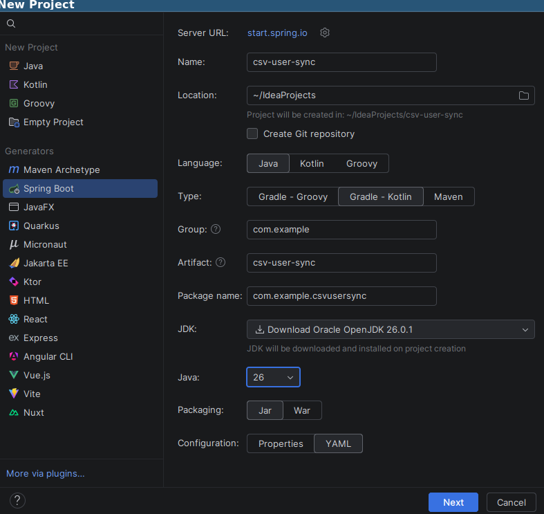
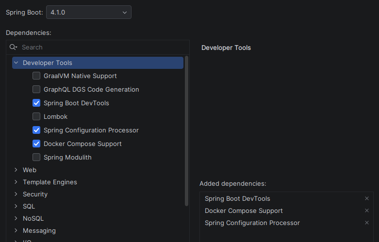
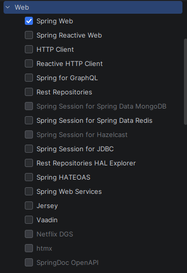
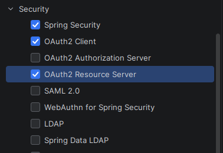
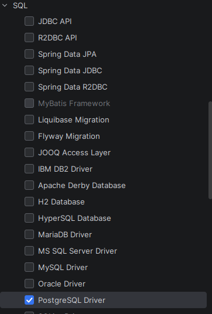

# CSV user sync

TLDR; A Spring Boot application that synchronizes `user accounts` and `roles` (permissions) from legacy SAP CSV exports into a PostgreSQL database. The service runs as a `daily scheduled job` and will be the foundation for a future modern authentication system using OpenID Connect.

This is my first Spring Boot application from scratch. So I'm better documenting
more than I should so that I can later refer to it later and learn from my mistakes.

## Tech and Dev-Stack

| Tool           | Version | Purpose                            | Link                                                                     |
|----------------|---------|------------------------------------|--------------------------------------------------------------------------|
| Spring Boot    | 4.1.0   | Framework                          | [spring.io/projects/spring-boot](https://spring.io/projects/spring-boot) |
| Kotlin         | –       | Programming language               | [kotlinlang.org](https://kotlinlang.org/)                                |
| Keycloak       | –       | Identity & Access Management (IAM) | [keycloak.org](https://www.keycloak.org/)                                |
| PostgreSQL     | –       | Database                           | [postgresql.org](https://www.postgresql.org/)                            |
| Docker Compose | –       | Container orchestration            | [docker.com/compose](https://www.docker.com/products/docker-compose/)    |

I'm not using my preferred editor Vim because [IntelliJ IDEA 2026.1.4 with JDK 25](https://www.jetbrains.com/idea/download/?section=linux) is packaging
all Java and project dependencies for me very nicely. Please note, that IntelliJ is also pushing AI everywhere, but I disabled
that plugin and want to explore things on my own.

## Project generation steps

- 
- 
- 
- 
- 

## Plan

- Start writing a parser for the CSV file (in a TDD like approach) => [MR](https://github.com/wikimatze/csv-user-sync/pull/1)
